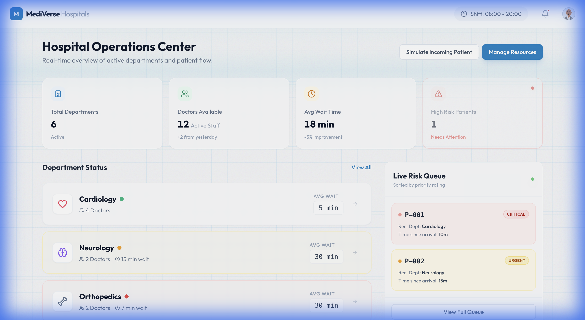

# MediVerse 🏥

**The Future of Healthcare Operations**

MediVerse is a cutting-edge, AI-powered hospital management dashboard designed to revolutionize patient triage and resource allocation. By leveraging advanced holographic UI paradigms and real-time AI assessments, it empowers medical professionals to make faster, more accurate decisions.



## 🚀 Key Features

- **Nurse Dashboard**: A centralized command center for monitoring patient flow, department occupancy, and critical alerts.
- **AI-Powered Triage**:
  - **Gemini Integration**: Uses Google's Gemini API to simulate realistic patient scenarios and generate instantaneous triage assessments (Risk Level, Department, reasoning).
  - **Robust Fallback**: Seamlessly switches to a rule-based mock system if the AI service is unavailable, ensuring 100% demo reliability.
- **Holographic UI**:
  - **3D Tilt Cards**: Interactive elements that respond to mouse movement for a tangible, futuristic feel.
  - **Scanning Beams**: Dynamic overlays that simulate real-time data scanning.
  - **Glassmorphism**: Premium, frosted-glass aesthetics for a clean, modern interface.
- **Interactive Simulation**: Built-in "Simulate Incoming Patient" feature to demonstrate the system's dynamic capabilities on demand.

## 🛠️ Tech Stack

- **Framework**: [React](https://react.dev/) + [Vite](https://vitejs.dev/)
- **Language**: [TypeScript](https://www.typescriptlang.org/)
- **Styling**: [Tailwind CSS](https://tailwindcss.com/) + Custom CSS for advanced VFX
- **Animations**: [Framer Motion](https://www.framer.com/motion/)
- **Icons**: [Lucide React](https://lucide.dev/)
- **AI Integration**: [Google Generative AI SDK](https://www.npmjs.com/package/@google/generative-ai)

## 📦 Installation & Setup

1.  **Clone the repository**
    ```bash
    git clone https://github.com/guru03-coder/MediVerse.git
    cd MediVerse
    ```

2.  **Install dependencies**
    ```bash
    npm install
    ```

3.  **Configure Environment Variables**
    Create a `.env` file in the root directory and add your Gemini API key:
    ```env
    VITE_GEMINI_API_KEY=your_gemini_api_key_here
    ```
    *(Note: The application will fall back to mock data if no key is provided, so you can still run it without one!)*

4.  **Run the development server**
    ```bash
    npm run dev
    ```

## 🖥️ Usage

- Open your browser and navigate to `http://localhost:5173`.
- **Login**: Use the demo credentials (or any email/password for the prototype).
- **Dashboard**: Access the Nurse Dashboard to view live stats.
- **Simulate**: Click the **"Simulate Incoming Patient"** button to trigger the AI triage system and see new patients appear in real-time.

## 🤝 Contributing

Contributions are welcome! Please feel free to submit a Pull Request.

## 📄 License

This project is licensed under the MIT License.
